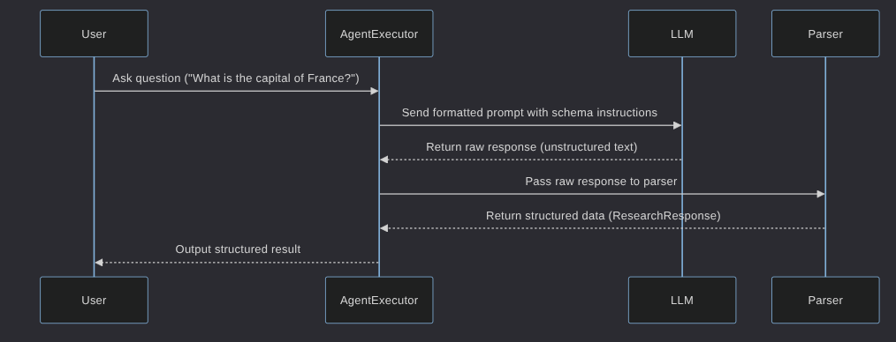

# Research Assistant Agent

## Problem Statement
This project creates a research assistant that answers questions and returns structured responses using large language models.

## Objectives
1. Generate consistent output in a predefined format.
2. Support multiple LLMs like OpenAI and Anthropic.
3. Provide clear execution feedback with an extensible agent system.

## How It Works

The assistant works by:
- Using a language model to answer queries.
- Enforcing a structured output format.
- Optionally calling tools in the future.

## Objectives
1. Generate consistent output in a predefined format.
2. Support multiple LLMs like OpenAI and Anthropic.
3. Provide clear execution feedback with an extensible agent system.

## How It Works

The assistant works by:
- Using a language model to answer queries.
- Enforcing a structured output format.
- Optionally calling tools in the future.

# Sequence Diagram

